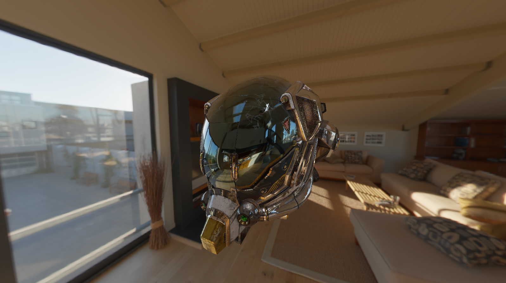
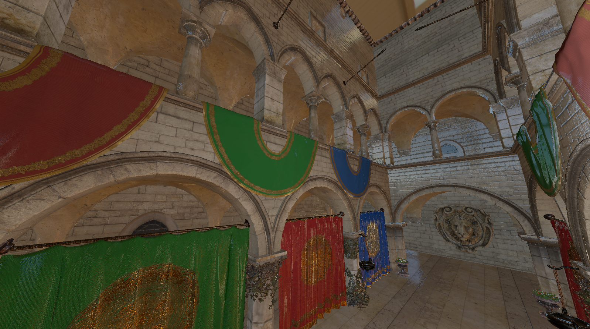

# Yuubi

A toy rendering engine built with Vulkan and C++23.




## Features

- Physically based rendering
- Image based lighting
- Multithreaded glTF texture loading
- Bindless descriptor sets used to reduce binding overhead
    - Buffer addresses are bound to descriptor sets during initialization and referenced in shaders
    - Textures are uploaded onto a descriptor array during model loading and indexed at runtime

## Local Development Setup

### Prerequisites

#### Graphics

- Vulkan 1.3 SDK

#### Compilers

- Clang 19.1.3
- MSVC 19.42

#### Build tools

- CMake 3.26
- Ninja 1.12

#### Package manager

- vcpkg

### Cloning the repo

```sh
git clone https://github.com/aldrazus/yuubi
```

### Building

Generate the project

```pwsh
cmake -B build -S .
```

Build the project in debug mode

```pwsh
cmake --build build --config Debug 
```

OR build the project in release mode

```pwsh
cmake --build build --config Release
```

### Running

```pwsh
./build/<Debug or Release>/yuubi
```
